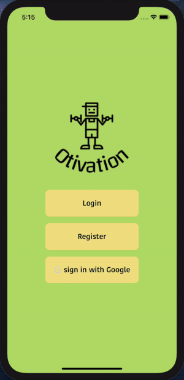
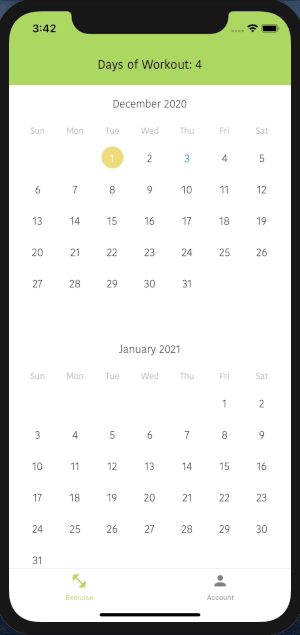
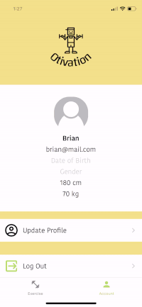

  

# Otivation

**Otivation** is an iOS/Android cross-platform mobile app for workouts to keep in track of what you achieved day to day. Otivation is built with React Native and Node.js.

#### Technology used

---

- [JavaScript](https://www.javascript.com/)
- [React Native](https://reactnative.dev/)
- [NodeJS](https://nodejs.org/en/)
- [ExpressJS](https://expressjs.com/)
- [PostgreSQL](https://www.postgresql.org/)

## Features

       

### Authentication  

- Register / Login with email and password
- Firebase Google Authentication
         

       

### CRUD exercises  

- Get, add, delete, update exercise to/from PostgreSQL database
- Fetch data realtime using useFocusEffect
         

       

### Personal Profile  

- Upload profile image
